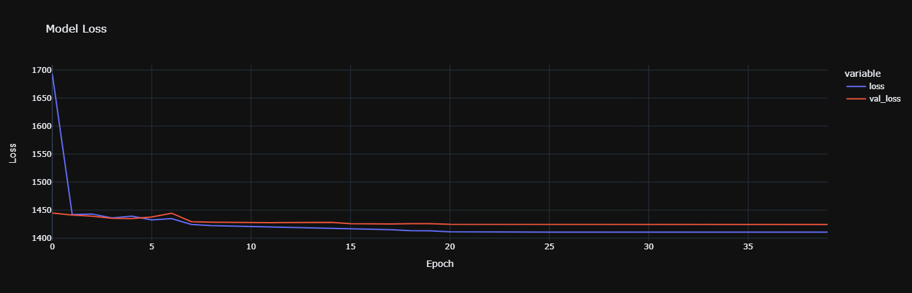
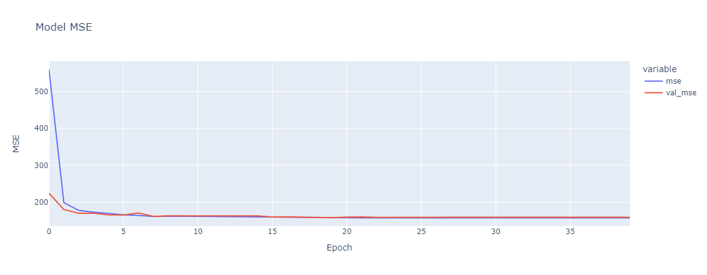
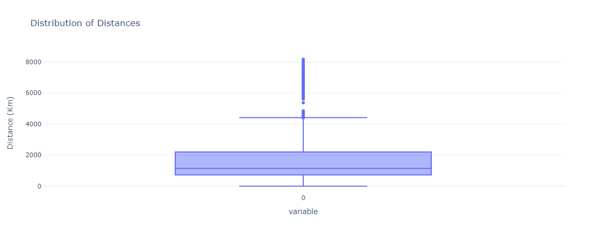

# Yachay.ai

## Tools Used 
        Hugging Face 
        Haversine Distance
        BERT Tokenizer
        RoBERTa Tokenizer
        Tensor Flow
        Keras
        Adam
        K Means
        MENET
        LSTM
        Convolutional Neural Network
        Plotly Express
        Pandas
        Streamlit

---
## Purpose

Yachay is an open-source machine learning community with decades worth of natural language data from media, the dark web, legal proceedings, and government publications. They have cleaned and annotated the data, and created a geolocation detection tool. They are looking for developers interested in contributing and improving on the project. We are given a dataset of tweets, and another dataset of coordinates, upon which we will create a neural network to predict coordinates from text. 

---

## Results

---
## Conclusions

First, we processed the dataframe as a time series to extract the time features. Then we processed the tweets using several Hugging Face pre-trained models: BERT, BERT multilingual, and XLM RooERTa. We found that the embeddings made using XLM performed better on a base neural network predicting geolocations. 

From there, we attempted to extract more features from the text with Hugging Face text classification pipelines. We were able to extract features such as sentiment, language, topic, and location. However, The location results were not great, as the pipelines proved it was difficult ot extract locations from short tweets, or even tweets with no mention of location. 

We concatenated the embeddings dataframe with the the added features. We then fed the merged dataframe into a neural network. Initially, we tried several architectures from LSTM, convolutional networks, GRU, recurrent networks, as well as several iterations of layers and neurons. We found the best results were with the MENET architecture, and decided to proceed. 

Multiple Entry Neural Network (MENET) is a type of neural network architecture that can learn from incomplete and noisy data. It achieves this by using multiple input sources, each with their own neural network, and combining their outputs for final prediction. While the architecture functioned well to start, we decided to feed different features into branches, and then combined the results. Consequently, we had the embeddings in one brach, the user ID, time features, and text features in separate branches. The branches were then concatenated and fed into a dense layer to predict latitude and longitude. Our model was trained with a haversine loss function adjusted to kilometers and mean squared error.  

Our results on the test set indicate a loss of 1414 Km and an MSE of 158. Overall distance predictions show a median and mean difference of 1146 and 1784 KMm, respectively.In trying to understand which features are most important, we found that removing the text feature led to the smallest increase in mean and median distances (1491, 1819). Cutting out the embeddings (6101, 6071) or the user ID (6279, 6229) branches led to a large increase in mean and median distances. We found that the model could not perform without the time features branch, as the loss and mse increased to infinity. 

In conclusion, the various features extracted from the data improved the predictions of our model. More hyperparameter tuning, could help to achieve a better result. A NER pipeline with better results would also likely increase the model performance. Furthermore, more data per user would also aid in improving the model, as some users wrote only a few tweets. Overall, Yachay could use this workflow to predict geolocations of tweets. 

---

## [Web Notebook](https://jodiambra.github.io/Yachay.ai/)

## [Website]